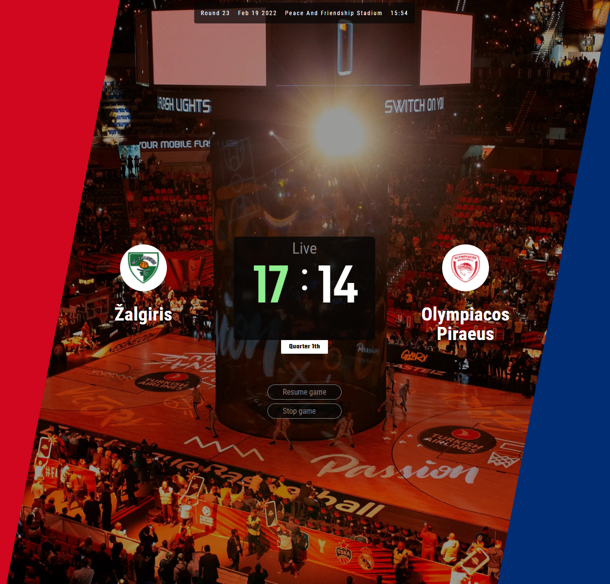

# Baskeball match simulator

This simulator show the simple basketball game website monitoring.

The goal for me was to learn more about NodeJs, backend + frontend and connect its together by API.

There are two separate main logics:

1. Backend server who serves API of basketball game
2. Frontend website whitch connect to backend by API and display game monitoring.
   

## Install

In terminal go to "backend" directory and run:

* `npm install`
* `npm run dev`

It will start the server on port 3000

**Do the same in "frontend" directory to init the frontend.**

It will start live server and opens web browser with basketball game website. If your web broser do not opened, try go to `http://127.0.0.1:8080`

## Backend

* backend runs on its own server and creates basketball API. You can reach this server at the address of `http://localhost:3000/` for example.
* posible methods:
  * init() -> to init game
  * start() -> to start game
  * pause() -> to pause game
  * stop() -> to make gameover.
    You can see the code in file: `backend\basketball.js`
* Note: the simulation runs 100 times faster. If you would like to do the normal simulation speed edit the backend\index.js to change these 3 lines:
`quarterTime: 6000, // there are 1 quarter time. Original shoud be 10 minutes, but know it set 100 times faster`
`attackTimeMin: 130, // min time in miliseconds witch team use to attack`
`attackTimeMax: 230, // max time in miliseconds witch team use to attack`

## Frontend

Simple website design with connection to backend server API.

Example of API connection:

`fetch('http://127.0.0.1:3000/').then((res) =>res.json()).then((dataObj) => {    console.log(dataObj) })`

## **About me**

I am junior Javascript and Python developer. If you like my code and would like to see my others works or contact with me, just visit my portfolio website at [Stonkus.lt](https://stonkus.lt/).

Thank you and happy to codding! :)
